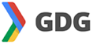

===============
 **What is a GDG?**
===============

Google Developer Groups (GDGs) are for developers who are interested in Google's developer technology; everything from the Android_, `App Engine`_, and `Google Chrome`_ platforms, to product APIs like the `Maps API`_, the `YouTube API`_ and `Google Calendar API`_.

A GDG can take many forms -- from just a few people getting together to watch our latest video, to large gatherings with demos and tech talks, to events like code sprints and hackathons. However, at the core, GDGs are focused on developers and technical content, and the core audience should be developers.

Starter Guide
=============

How to Describe a GDG
=====================

Incubating Stage
=================

Community & Organization
=========================

Impact outside GDG
===================

.. Add all your hyperlink references here for clarity and convenience
.. _Android: http://developer.android.com
.. _App Engine: https://developers.google.com/appengine/
.. _Google Chrome: https://developers.google.com/chrome/
.. _Maps API: https://developers.google.com/maps/
.. _YouTube API: https://developers.google.com/youtube/
.. _Google Calendar API: https://developers.google.com/google-apps/calendar/